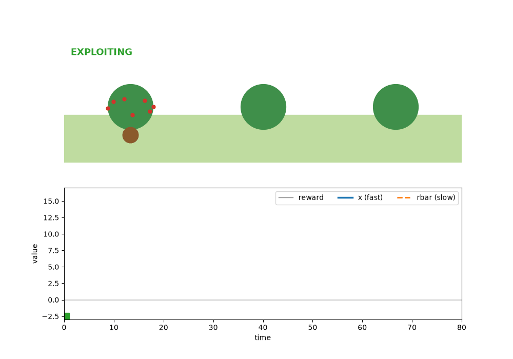
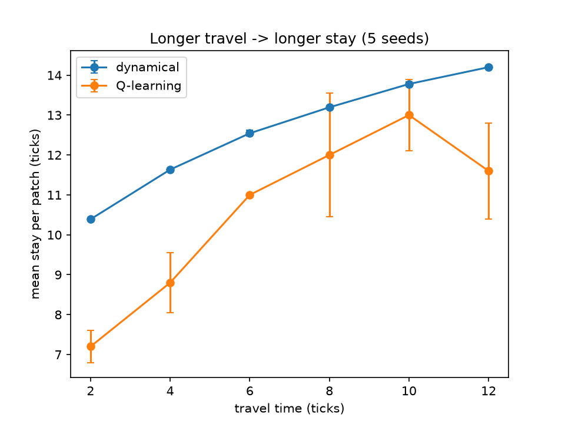

# Foraging-RL-Dynamics

Patch-Leaving Decisions in a Depleting Environment

A Dynamical Systems Model Compared With a Q-Learning Baseline



*A simulated forager (squirrel) alternates between exploiting a depleting patch (green) and traveling to a new one (orange). The plot below the scene shows the internal state x, the long-term reward rate rbar, and the reward received at each tick.*

## 🧠 Scientific Scenario

In natural environments, animals constantly face a fundamental decision problem while foraging:

Should they stay and exploit a currently available food source, or leave and explore for a potentially better one?

This is known as the exploration–exploitation trade-off. In foraging settings it has a specific structure:

- Food sources (patches) deplete while the animal eats from them

- Moving to a new patch costs energy and time

- Patches differ in richness, so the environment is non-stationary from the animal's point of view

- A good decision depends on the history of experienced rewards, not only the current reward

This is the classic patch-leaving problem. Marginal value theorem (MVT) states that an animal maximizing its long-term intake rate should leave a patch when the instantaneous reward rate drops to the average rate of the environment.

This project builds a small computational model to ask:

Can a simple internal dynamical variable, compared against a slowly learned average reward rate, produce MVT-like patch-leaving behavior, and how does this compare with a tabular Q-learning agent on the same task?

### The model combines:

- A depleting multi-patch foraging environment with travel time and travel cost

- A decision agent with two internal variables evolving on different timescales

- A tabular Q-learning baseline

- An animation and a behavioral analysis (stay duration as a function of travel time)

## 📁 Project Structure

```
foraging_rl_dynamics/
│
├── environment.py
├── agent_dynamics.py
├── agent_rl.py
├── run_experiment.py
├── analysis.py
├── animate.py
└── requirements.txt
```

## 🔹 environment.py — Depleting Patches With Travel

### Scientific Idea

Three patches in a row. At each time step (tick) the agent either stays or leaves.

- **Stay:** the agent receives the current reward of the patch, then the patch reward is multiplied by `decay` (default 0.9)

- **Leave:** the agent pays `travel_cost` (default 1.5) and walks for `travel_time` ticks (default 5) to a different patch, receiving zero reward on the way

- **Arrival:** a fresh patch is drawn with an initial richness sampled uniformly from 6 to 15

The agent cannot know the richness of a new patch in advance, so each patch is a new, differently rich source.

### Key Mechanisms in Code

- `self.reward *= self.decay` → gradual depletion of the resource

- `travel_left` counts down while walking, and actions are ignored during travel → a real time cost for leaving

- `state()` returns the number of ticks spent in the current patch, or the travel countdown, which the RL agent uses as its state

## 🔹 agent_dynamics.py — Two-Timescale Dynamical Agent

### Scientific Idea

The agent has two internal variables.

**Fast state x** tracks recent rewards inside the current patch:

$$x \leftarrow x + \tau\,(r - x)$$

**Slow variable rbar** tracks the long-term average reward rate across patches and travel:

$$\bar r \leftarrow \bar r + \tau_{slow}\,(r - \bar r)$$

with `tau = 0.3` and `tau_slow = 0.05`.

On arrival at a new patch, x is reset to an initial expectation `x0 = 10`.

### Decision Rule

The agent leaves when the fast state falls below the long-term rate:

```
leave if x < rbar
```

This is an MVT-style rule: leave when the recent reward rate drops below the environment average. It is a fixed rule, not a learned one. What is learned from experience is the comparison value rbar, which adapts to the richness of the environment and the cost of traveling.

The parameters (`tau`, `tau_slow`, `x0`) were chosen by hand and are not fit to any behavioral data.

## 🔹 agent_rl.py — Q-Learning Baseline

### Scientific Idea

A tabular Q-learning agent with a Q-table over (state, action).

- State: number of ticks spent in the current patch (capped at 30), or the travel countdown while walking

- Actions: stay or leave

- Parameters: learning rate 0.1, discount 0.95, epsilon-greedy exploration (epsilon = 0.2 during training, 0 at test time), trained for 60,000 ticks

This agent has no built-in notion of a reward rate. It must learn when to leave from experience alone. It is a deliberately simple baseline, and no claim is made that it is the best possible RL agent for this task.

## 🔹 run_experiment.py — Agent–Environment Interaction

### Scientific Idea

This file runs the simulation loop for either agent:

1. The agent decides whether to stay or leave

2. The environment returns a reward and whether the agent is exploiting or exploring

3. The agent updates its internal state (or its Q-table)

For every tick it records the reward, the internal variables, the position and the mode (exploit or explore). It also provides `mean_stay` (average number of ticks spent per patch visit) and `train_rl`.

## 🔹 analysis.py — Stay Duration vs. Travel Time

### Scientific Idea

MVT predicts a clear qualitative result: the longer it takes to reach a new patch, the longer the forager should stay in the current one.

This file tests that prediction. For travel times of 2, 4, 6, 8, 10 and 12 ticks, it measures the mean stay per patch for both agents, averaged over 5 seeds (error bars show the standard deviation across seeds).



### Results

| Travel time (ticks) | Dynamical agent | Q-learning |
|---|---|---|
| 2 | 10.4 | 7.2 |
| 6 | 12.5 | 11.0 |
| 10 | 13.8 | 13.0 |
| 12 | 14.2 | 11.6 |

Mean stay per patch, in ticks.

- Both agents stay longer when travel is longer, which is qualitatively consistent with the MVT prediction

- The dynamical agent shows a smooth, almost deterministic increase, since it has no learning noise

- The Q-learning agent follows the same trend but with more variability across seeds, and it drops at travel time 12. This is probably a training issue (more states and the same 60,000 training ticks), but this has not been tested

No claim is made about which agent is better. The two agents are compared on one behavioral signature only.

## 🔹 animate.py — Animation

Runs a single episode of the dynamical agent and shows it as an animation:

- Top: the squirrel eats at a patch (berries decrease) or walks to a new one

- Bottom: reward, x and rbar over time, with a green/orange bar marking exploitation and exploration

- Sliders let you set the speed of exploitation and exploration separately, and there are Pause and Restart buttons

To also save the animation as `foraging.gif`, set `SAVE_GIF = True` at the top of `animate.py`.

## 🎯 Key Takeaways

- A two-timescale internal state (a fast reward estimate compared with a slow average rate) is enough to produce patch-leaving behavior that follows the MVT prediction about travel time

- A simple tabular Q-learning agent with a "ticks in patch" state learns qualitatively similar behavior, but it needs many training steps and shows more variability

- The model is a minimal illustration, not a model fit to animal data

## ⚠️ Limitations

- Parameters of the dynamical agent were set by hand, not fitted

- The environment is simple (three patches, fixed decay and cost, uniform richness)

- Only stay duration vs. travel time was analyzed, using 5 seeds

- The RL baseline is basic (tabular, fixed hyperparameters, no tuning)

- No comparison with real behavioral data

## ▶️ How to Run the Project

1) Clone the repository

```
git clone <your-repo-url>
cd foraging_rl_dynamics
```

2) Install dependencies

```
pip install -r requirements.txt
```

3) Run the simulation (prints mean stay and total reward for both agents)

```
python run_experiment.py
```

4) Reproduce the stay-duration vs. travel-time plot

```
python analysis.py
```

5) Run the interactive animation

```
python animate.py
```

On Windows, if `python` is not recognized, use `py` instead (for example `py animate.py`).

---

## 👨‍💻 **Author**

**Erfan Eslamieh**

M.Sc. in Cognitive Science – Specializing in Generative AI, Machine Learning, and Deep Learning  
📧 [erfan.cognitive.work@gmail.com]   
🔗 [](https://linkedin.com/in/erfan-eslamieh) [](https://www.kaggle.com/erfaneslamieh)

